# Dynamic Assessment Protocol (DAP): System Architecture & Prototype

This repository contains the functional prototype of the **Weighted Authorship Matrix (WAM)**, the core instrument of the **Dynamic Assessment Protocol (DAP)**. It is a tangible deliverable for the Master's Thesis: *A Dynamic Protocol (DAP) Design for Signal Clarity in Generative AI Education: An HCI-Ethical Approach*.

## Quick participant guide / Korte deelnemersuitleg

### English

This prototype is part of a Master's thesis about how universities can make rules for AI use in assignments clearer. You are not being tested. The goal is to see whether the interface is understandable.

The prototype uses the same underlying DAP/WAM logic in two interfaces:

- **Matrix Builder:** shows several assessment components in one table. It is denser, but it gives an overview of the whole assessment. If a combination is problematic, such as high grading weight + AI allowed + weak evidence, the table shows a warning.
- **Wizard:** guides you through one assessment component step by step. Some evidence options may be disabled when the rule would be inconsistent or disproportionate.

Important terms:

- **Component:** the part of the assignment being assessed.
- **Tooling:** whether AI is prohibited, partly allowed, or fully allowed.
- **Evidence:** what the student must provide to show their own understanding.
- **Weight:** how much this component counts in the grade.

During the test, please say what feels clear or confusing. There are no right or wrong answers.

## 🔗 View the Live Prototype
**[Access the Interactive WAM Builder Here](https://YIN-Renlong.github.io/DAP-WAM-Prototype/dap-prototype.html)**

**[Access the Interactive WAM Wizard Here](https://yin-renlong.github.io/DAP-WAM-Prototype/dap-wizard.html)**

---

## 🔗 Flowchart

```mermaid
flowchart TD
    A["CS WAM Matrix Builder<br/>Computer Science / Software Design"] 
    --> B["Inputs for each assessment row"]

    B --> X1["Component<br/>System Architecture<br/>Core Logic<br/>Syntax / Boilerplate<br/>Documentation<br/>Debugging"]

    B --> X2["Tooling<br/>Student Only<br/>Hybrid / Co-Pilot<br/>AI Allowed"]

    B --> X3["Granularity<br/>Assignment-Level<br/>Diagram-Level<br/>File-Level<br/>Function-Level<br/>Line-Level"]

    B --> X4["Evidence Required<br/>AI-use label only<br/>E1: Final output only<br/>E2: Process evidence<br/>E3: Explanation evidence<br/>E4: Live check"]

    B --> X5["Weight<br/>Percentage of total grade"]

    X1 --> R["Compiled assessment-row state"]
    X2 --> R
    X3 --> R
    X4 --> R
    X5 --> R

    R --> C["Derive logic flags<br/><br/>
    AI permitted = Hybrid / Co-Pilot OR AI Allowed<br/>
    Weak evidence = AI-use label only OR E1<br/>
    Strong evidence = E3 OR E4"]

    C --> D{"Weight >= 25%<br/>AND AI permitted<br/>AND weak evidence?"}

    D -- Yes --> D1["ERROR: Integrity Error<br/>High-value AI-assisted work needs stronger evidence.<br/>Require E2, E3, or E4."]
    D -- No --> E{"Weight <= 10%<br/>AND strong evidence?"}
    D1 --> E

    E -- Yes --> E1["WARNING: Proportionality Warning<br/>Low-weight task asks for heavy evidence.<br/>May create unnecessary workload."]
    E -- No --> F{"Component contains<br/>Syntax or Boilerplate<br/>AND Weight > 20%<br/>AND AI permitted?"}
    E1 --> F

    F -- Yes --> F1["WARNING: Pedagogy Warning<br/>Too much credit for routine code<br/>when AI is allowed."]
    F -- No --> G{"Component contains<br/>Architecture<br/>AND Granularity = Line-Level?"}
    F1 --> G

    G -- Yes --> G1["WARNING: Granularity Warning<br/>Architecture is a macro-level task.<br/>Use Diagram-Level or Assignment-Level instead."]
    G -- No --> H{"Any row issues?"}
    G1 --> H

    H -- No --> H1["Row feedback:<br/>Valid alignment"]
    H -- Yes --> H2["Row feedback:<br/>Show error and/or warning messages"]

    H1 --> I["Aggregate whole matrix"]
    H2 --> I

    I --> J["Calculate total weight<br/>Count blocking errors<br/>Count advisory warnings"]

    J --> K{"Total weight = 100%?"}

    K -- No --> K1["Status:<br/>Fix total weight<br/>Publishing disabled"]
    K -- Yes --> L{"Blocking errors > 0?"}

    L -- Yes --> L1["Status:<br/>Blocking issue found<br/>Publishing disabled"]
    L -- No --> M{"Advisory warnings > 0?"}

    M -- Yes --> M1["Status:<br/>Publishable with warnings<br/>Publishing enabled"]
    M -- No --> M2["Status:<br/>Matrix valid<br/>Publishing enabled"]

    classDef error fill:#fee2e2,stroke:#dc2626,color:#7f1d1d;
    classDef warning fill:#fef3c7,stroke:#d97706,color:#78350f;
    classDef valid fill:#dcfce7,stroke:#16a34a,color:#14532d;
    classDef status fill:#e0f2fe,stroke:#0284c7,color:#0c4a6e;
    classDef input fill:#ede9fe,stroke:#8b5cf6,color:#1f2937;

    class X1,X2,X3,X4,X5,R,C input;
    class D1,L1 error;
    class E1,F1,G1 warning;
    class H1,M2 valid;
    class K1,M1 status;
```

 

## Part 1: Theoretical Architecture & The Re-definition of "Evidence"

In traditional, pre-AI pedagogy, submitting a static file (e.g., 500 lines of manual code) was considered **"Strong Evidence"** of learning. The *process* of manual typing guaranteed the student's cognitive engagement (Process Certainty). 

In the GenAI era, static files are computationally commoditized. Therefore, the DAP fundamentally redefines "Evidence." Evidence no longer measures *how hard a student worked*; it measures *how difficult it is for a student to fake their understanding using AI* (Outcome Certainty).

*   **E1 (Weak Evidence):** Static artifacts (code files, essays, basic execution logs). Highly vulnerable to undetected AI generation. A student can produce E1 in seconds with zero comprehension.
*   **E2 (Moderate Evidence):** Process artifacts (Git commit histories, documented debugging logs, unit tests). Proves the student engaged with the logic, though AI may have assisted.
*   **E3 (Strong Evidence):** Cognitive artifacts (Architectural Diagrams, Design Rationales). The student must explain *why* a system is built a certain way. AI can write code, but defending the architecture requires a "System Auditor" mindset.
*   **E4 (Live Contextual):** The ultimate unfakeable proof. A 10-minute live viva/interrogation where the student must verbally defend specific logic choices to the assessor.

---

## Part 2: The "Tier 1 Paradox" & Procedural Justice

The DAP explicitly maps out the logical trap of banning AI (**Tier 1: Foundational**). 

If an instructor strictly forbids AI, they face a paradox: **How do they prove the student didn't use it?** 
There are only two methods:
1.  **Unethical Surveillance:** Forcing students to install invasive screen-recording or keystroke-tracking software. The DAP's Value-Sensitive Design explicitly rejects this due to privacy, equity, and anxiety concerns.
2.  **The Honor System (E1):** The student submits the finished code, and the instructor simply has to trust them. 

**The General Case of Systemic Failure:**
What happens if a student submits E1 (Weak Evidence) under a Tier 1 (No AI) policy, and the professor says, *"I don't trust you; this looks like AI"*? 

Without the DAP, this results in **Epistemic Injustice**. The student is accused based on "vibes" or flawed AI detectors, and has no way to prove a negative (that they *didn't* use a tool).

**The DAP Solution (Procedural Justice):**
If a professor utilizes the WAM, they enter a digital contract. If they suspect cheating, they cannot arbitrarily fail the student based on suspicion of E1 evidence. The DAP forces them to trigger **Layer 3: Contextual Verification**. They must schedule a live viva (E4) and ask: *"Explain lines 10-20."* If the student can explain the logic, they pass. The DAP replaces a culture of "policing and suspicion" with one of "verifiable outcome certainty."

---

## Part 3: The Universal System Logic (General Case)

The WAM is an interactive "Boundary Object" (Star & Griesemer, 1989). Its drop-down menus are not independent choices; they are mathematically and pedagogically coupled variables. The UI acts as a logic engine to enforce **Constructive Alignment**.

The universal logic of the DAP is defined by three interconnected ratios:

1.  **The Verification Equilibrium ($Tooling \propto Evidence$):** As the computational agency of the AI increases (from "Student Only" to "AI Allowed"), the cognitive burden on the student must shift from *generation* to *verification*. High AI allowance demands higher Evidence Strength.
2.  **The Scrutiny Resolution ($Component \propto Granularity$):** The "Zoom Level" of disclosure must match the abstraction level of the task. If a student is designing "System Architecture" (Macro), forcing "Line-Level" (Micro) disclosure is an HCI failure that creates cognitive overload.
3.  **The Mastery Lock ($Component \propto Weight$):** The grading weight must reflect the specific Persona being tested. In a Tier 3 (Architectural) class, manual typing should carry low weight, while system verification carries high weight.

---

## Part 4: The Constraint Engine (Encoded Rules)

To prevent instructors from building flawed rubrics, the React prototype actively scans the WAM state for specific "Anti-Patterns" and throws UI warnings/errors.

#### 🟥 Anti-Pattern 1: The Free-Rider Loophole
*   **Condition:** `(Weight >= 25%)` AND `(Tooling == 'AI Allowed' OR 'Hybrid')` AND `(Evidence <= E1)`
*   **System Response:** `TRIGGER ERROR` (Disables publishing)
*   **Architectural Rationale:** This prevents the total collapse of assessment integrity. If a task is worth a massive portion of the grade, and AI is allowed to do the heavy lifting, the instructor *must* demand moderate-to-strong cognitive evidence (E2/E3) that the student can audit the AI's output. Accepting Weak Evidence (E1) here creates a massive Epistemic Blind Spot where students get "A"s for clicking "Generate."

#### 🟨 Anti-Pattern 2: The Surveillance Trap (HCI Friction)
*   **Condition:** `(Weight <= 10%)` AND `(Evidence >= E3)`
*   **System Response:** `TRIGGER WARNING`
*   **Architectural Rationale:** Enforces the HCI principle of minimizing user friction. Demanding rigorous cognitive proof (e.g., a multi-page rationale or live viva) for a trivial, low-stakes task (e.g., adding code comments) creates disproportionate cognitive overload ("False Difficulty"). 

#### 🟨 Anti-Pattern 3: Manual Labor Misalignment
*   **Condition:** `(Component == 'Syntax/Boilerplate')` AND `(Weight > 20%)` AND `(Tooling == 'AI Allowed')`
*   **System Response:** `TRIGGER WARNING`
*   **Architectural Rationale:** Prevents grading the AI instead of the student. If a course heavily weights the manual production of syntax, the instructor must restrict tooling to "Student Only." If they allow AI to type the syntax, that component's weight must be reduced, shifting the grading weight to architectural design or debugging.

#### 🟨 Anti-Pattern 4: Granularity Mismatch (Conceptual Design Rule)
*   **Condition:** `(Component == 'Macro/Architecture')` AND `(Granularity == 'Line-Level')`
*   **Architectural Rationale:** Prevents the "Transparency Paradox." Forcing students to document microscopic AI usage (e.g., "AI autocompleted line 42") on macroscopic tasks destroys their workflow and incentivizes them to hide their AI use entirely to avoid the administrative burden.

---

## 🗺️ The 2D "Risk Topography" Heatmap

This prototype maps DAP/WAM rule logic into a two-dimensional policy surface. It visually translates abstract constraint logic (HCI) into an interactive geographical "safe zone" and "risk zone," allowing stakeholders to explore the boundaries of GenAI policy without filling out a form.

**[Access the 2D Risk Topography Heatmap Here](https://yin-renlong.github.io/DAP-WAM-Prototype/dap-heatmap.html)** 

* **X-Axis (Grading Weight):** From 0% to 100%.
* **Y-Axis (Evidence Strength):** From Label Only (Weak) to E4 Live Check (Strong).
* **Dynamic Inspector:** Hovering over the grid instantly evaluates the intersection of Weight, Evidence, Tooling, and Component.
* **Instant Consequences:** It translates the DAP/WAM matrix rules into real-world outcomes, contrasting the **Professor Experience** (e.g., grading fatigue vs. efficient auditing) against the **Student Experience** (e.g., unfair administrative burden vs. psychological safety).

By physically visualizing thresholds (like the 10% Surveillance Trap limit and the 25% Free-Rider limit) as hard geographical borders, this heatmap proves that DAP/WAM rules are not arbitrary text, but a mathematical boundaries protecting academic integrity.

---

**Thesis Context**

- **Author:** YIN Renlong
- **Supervisor:** Prof. Katherine Verbert
- **Thesis Mentor:** John Kelly Tamargo

## **Appendix: Quick guide for Biological Science participants / Korte uitleg voor Biologische Wetenschappen**

### **Nederlands**

**Auteur:** YIN Renlong  
**Achtergrond:** theologie/religiewetenschappen, computerwetenschappen en digitale geesteswetenschappen.

Dit prototype maakt deel uit van een masterproef over hoe universiteiten regels voor AI-gebruik in opdrachten duidelijker kunnen maken. Jij wordt niet getest. Het doel is om te zien of de interface begrijpelijk is.

Voor biologische wetenschappen helpt het prototype docenten om duidelijkere regels te ontwerpen voor AI-gebruik in opdrachten zoals labverslagen, experimenteel ontwerp, data-analyse of wetenschappelijke discussies.

Het prototype gebruikt dezelfde onderliggende logica in twee interfaces. In dit project betekent **DAP** **Dynamic Assessment Protocol**: een manier om duidelijkere beoordelingsregels voor AI-gebruik te ontwerpen. **WAM** betekent **Weighted Authorship Matrix**: een tabel die AI-beleid, gevraagd bewijs en beoordelingsgewicht met elkaar verbindt.

De twee interfaces zijn:

* **Matrix Builder:** toont meerdere biologische beoordelingsonderdelen in één tabel. Deze interface geeft overzicht over de hele beoordeling. Als een combinatie problematisch is, bijvoorbeeld hoog gewicht + AI toegestaan + zwak bewijs, toont de tabel een waarschuwing.

* **Wizard:** begeleidt je stap voor stap door één biologisch beoordelingsonderdeel. Sommige bewijsopties kunnen worden uitgeschakeld wanneer een regel inconsistent of disproportioneel zou zijn.

In de modus Biologische Wetenschappen zijn de onderdelen:

* **Achtergrond, Onderzoeksvraag & Hypothese**
* **Experimenteel Ontwerp, Variabelen & Controles**
* **Dataverzameling, Labjournaal & Ruwe Observaties**
* **Data-analyse, Statistiek & Figuren**
* **Discussie, Beperkingen & Wetenschappelijke Argumentatie**

Belangrijke termen:

* **Component:** het deel van de biologische opdracht dat wordt beoordeeld.
* **Tooling:** of AI verboden, gedeeltelijk toegestaan of volledig toegestaan is.
* **Granulariteit:** het detailniveau van de gevraagde verantwoording, bijvoorbeeld per sectie, claim, figuur/tabel of observatie/datapunt.
* **Bewijs:** wat de student moet aanleveren om eigen biologisch begrip te tonen.
* **Gewicht:** hoeveel dit onderdeel meetelt voor het cijfer.

In dit prototype betekent zwak bewijs dat de student alleen een AI-gebruikslabel, een eindverslag, een eindgrafiek of een eindantwoord aanlevert. Sterker bewijs kan bestaan uit labjournaalnotities, ruwe data, protocolnotities, analysebestanden, uitleg van controles of statistische keuzes, of een korte mondelinge check.

Tijdens de test mag je hardop zeggen wat duidelijk of verwarrend is. Er zijn geen juiste of foute antwoorden.

### **English**

This prototype is part of a Master's thesis about how universities can make rules for AI use in assignments clearer. You are not being tested. The goal is to see whether the interface is understandable.

For biological science, the prototype helps instructors design clearer AI-use rules for assignments such as lab reports, experimental design tasks, data analysis assignments, or scientific discussion sections.

The prototype uses the same DAP/WAM logic in two interfaces:

* **Matrix Builder:** shows several biology assessment components in one table. It gives an overview of the whole assessment. If a combination is problematic, such as high grading weight + AI allowed + weak evidence, the table shows a warning.

* **Wizard:** guides you through one biology assessment component step by step. Some evidence options may be disabled when the rule would be inconsistent or disproportionate.

In the Biological Science mode, the components are:

* **Background, Research Question & Hypothesis**
* **Experimental Design, Variables & Controls**
* **Data Collection, Lab Notebook & Raw Observations**
* **Data Analysis, Statistics & Figures**
* **Discussion, Limitations & Scientific Argument**

Important terms:

* **Component:** the part of the biology assignment being assessed.
* **Tooling:** whether AI is prohibited, partly allowed, or fully allowed.
* **Granularity:** the level of detail required, for example section-level, claim-level, figure/table-level, or observation/data-point-level.
* **Evidence:** what the student must provide to show their own biological understanding.
* **Weight:** how much this component counts in the grade.

In this prototype, weak evidence means that the student only provides an AI-use label, a final lab report, a final graph, or a final answer. Stronger evidence can include lab notebook notes, raw data, protocol notes, analysis files, explanations of controls or statistical choices, or a short oral check.

During the test, please say what feels clear or confusing. There are no right or wrong answers.

### Nederlands

Dit prototype maakt deel uit van een masterproef over hoe universiteiten regels voor AI-gebruik in opdrachten duidelijker kunnen maken. Jij wordt niet getest. Het doel is om te zien of de interface begrijpelijk is.

Het prototype gebruikt dezelfde onderliggende DAP/WAM-logica in twee interfaces:

- **Matrix Builder:** toont meerdere beoordelingsonderdelen in één tabel. Deze interface is compacter en drukker, maar geeft overzicht over de hele beoordeling. Als een combinatie problematisch is, bijvoorbeeld hoog gewicht + AI toegestaan + zwak bewijs, toont de tabel een waarschuwing.
- **Wizard:** begeleidt je stap voor stap door één beoordelingsonderdeel. Sommige bewijsopties kunnen worden uitgeschakeld wanneer een regel inconsistent of disproportioneel zou zijn.

Belangrijke termen:

- **Component:** het deel van de opdracht dat wordt beoordeeld.
- **Tooling:** of AI verboden, gedeeltelijk toegestaan of volledig toegestaan is.
- **Bewijs:** wat de student moet aanleveren om eigen begrip te tonen.
- **Gewicht:** hoeveel dit onderdeel meetelt voor het cijfer.

Tijdens de test mag je hardop zeggen wat duidelijk of verwarrend is. Er zijn geen juiste of foute antwoorden.
